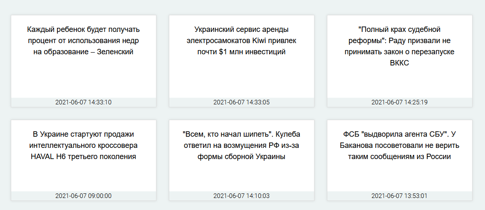
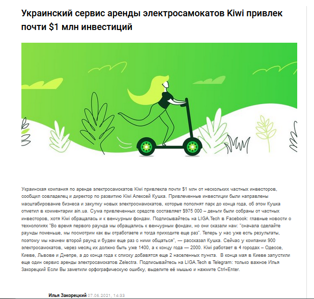

<h2 align="center">Парсинг сайта новостей</h2>

Социальная сеть на Django 3.2.

### Инструменты разработки

**Стек:**
- Python >= 3.9
- Django 3.2
- BeautifulSoup 4

###Основной функционал:
- Парсинг главной страницы сайта новостей (парсинг заголовка, даты и ссылки на новость)
- Вывод заголовков и даты публикации на главной странице:

- Парсинг статьи с сайта новостей при переходе в новость на главной странице:
(парсинг заголовка, даты, автора и картинки)

